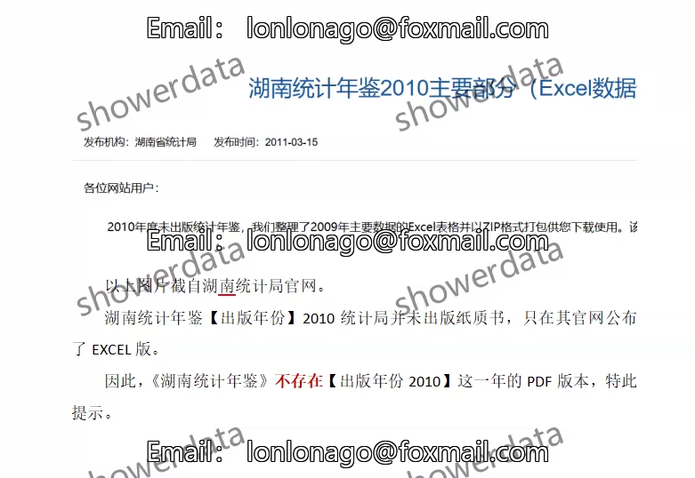
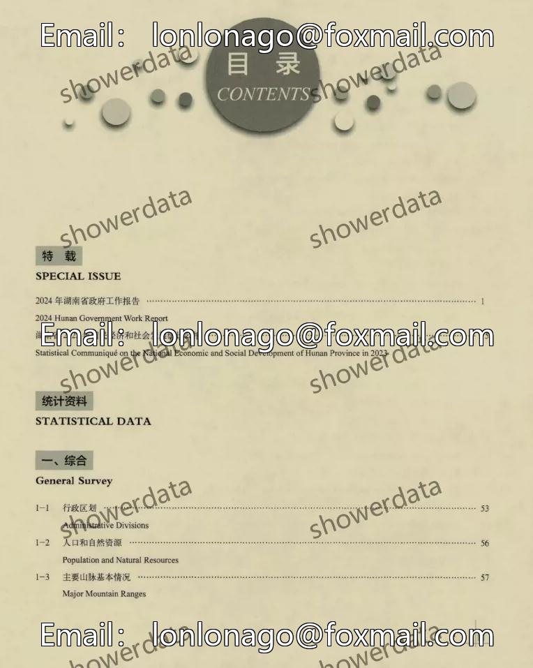
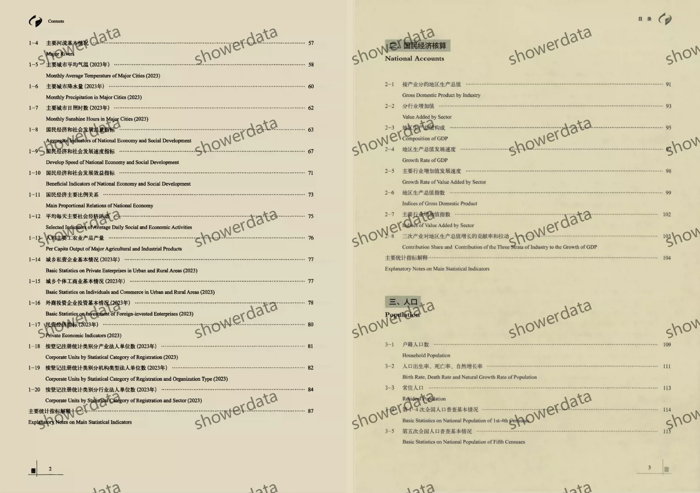
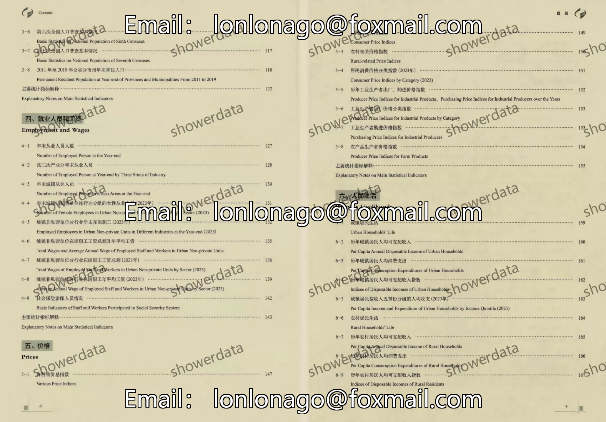
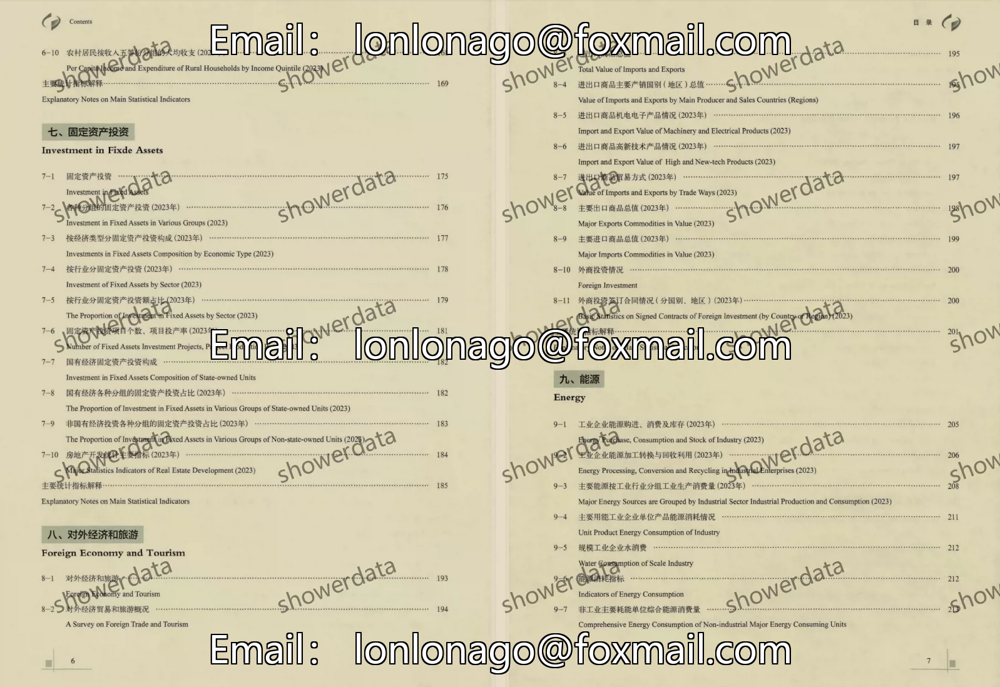
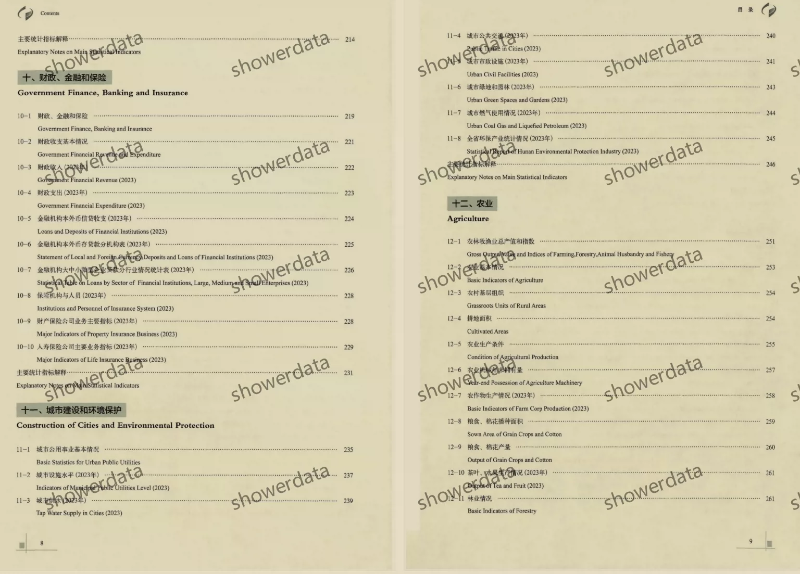
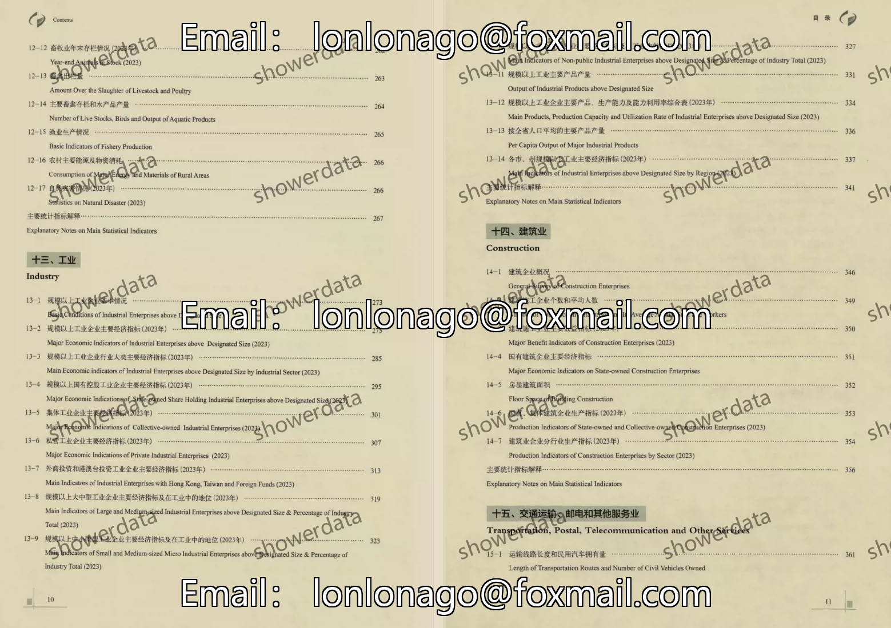
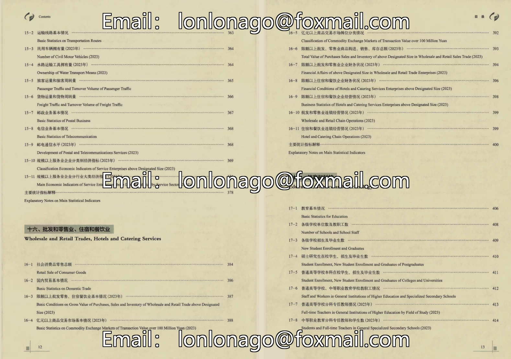

## Body

"Hunan Statistical Yearbook"

01. Data Introduction
The "Hunan Statistical Yearbook"

02. Indicator Details
The catalog is displayed in the image for reference, based on the actual content of the yearbook. Please view it independently and make your purchase accordingly. The indicators are numerous, and I cannot assist in finding data. All information is here. After shipment, returns without reason are not supported.
The display catalog is for the year 2024, and only a few chapters are shown for reference. Different years may have varying statistical criteria, and academic knowledge is expected to be understood.

03. Data Format
Format: PDF and Excel, with only Excel available for 2025.

## Images

item_1047218539819

Here is a pay link on Stripe ( https://buy.stripe.com/3cs8yP7sY87d0vu9AB ). Please contact me lonlonago@foxmail.com after funding $89, and I will send you a complete data files , thank you!

